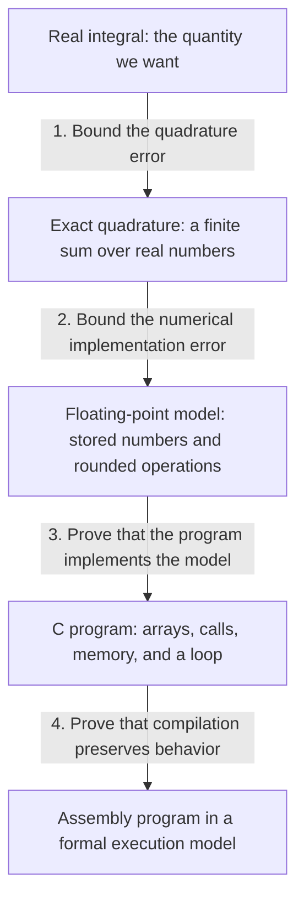
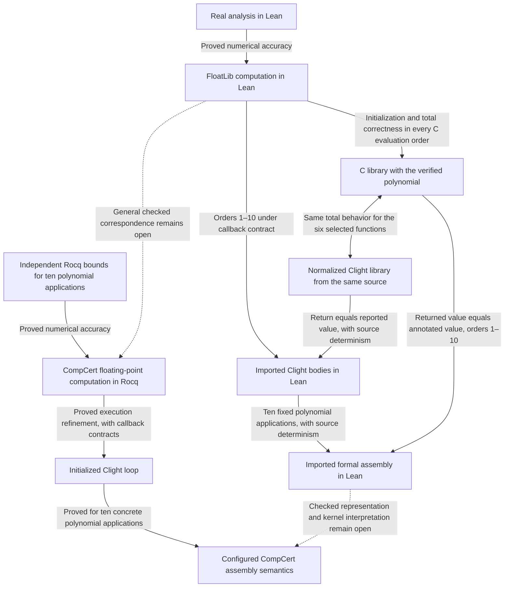

# From an integral to a machine result

*Gaussian quadrature, the Appel–Bindel paper, and what our formalization actually proves.*

[Open the interactive version](interactive/index.html) for rendered LaTeX, a quadrature explorer, a walkthrough of the two C-loop iterations, and the Lean and Rocq verification routes.

Suppose a C program returns `0.83791182769499317`. We want to know whether that number is a good approximation to an integral.

Running the program tells us what happened on that run. A numerical proof explains how far its result can be from the integral. A program proof connects that numerical reasoning to the instructions the program executes. Getting all of these to refer to the same computation is the central problem.

Andrew W. Appel and David S. Bindel's paper, *Formalization of Gaussian Quadrature and Application Verification (Preliminary Draft)*, takes on that problem for a small quadrature library. The title matters: the authors are presenting work in progress, including admitted lemmas and unfinished program assembly. The [review record](../evidence/upstream-review.json) identifies the author PDF and accompanying source examined here. Its running example is

$$
f(x)=\frac12(1-x)\cos x,
\qquad
I=\int_{-1}^{1}f(x)\,dx.
$$

The C implementation evaluates a weighted sum at carefully chosen points. The paper aims to prove that this implementation approximates the real integral, including its floating-point errors.

Our separate LeanQuadrature development corrects specific claims and adds proofs in both Lean and Rocq. It is not a completed formalization of every part of the paper in Lean. Understanding its boundary starts with two questions: how accurate is the calculation we intend to perform, and does the actual program perform that calculation?

**Four findings concern the paper's claims and constants:** [a two-point error bound that is too small](#issue-two-point), [a one-point error bound that is too small](#issue-one-point), [inconsistent indexing in the remainder theorem](#issue-remainder), and [different stored weights in C and the proof model](#issue-weight). A further source review found [two false overflow helper inequalities](#issue-overflow). The calculation below explains the contradictions. The unfinished connection between our Lean and Rocq proofs is a separate issue in our project.

The words *numerical method*, *functional model*, and *program* refer to different descriptions of the computation. A numerical method can be analyzed using exact real numbers. A functional model specifies the stored values and rounded operations. A C program implements its computation through memory accesses, calls, and a loop. A proof about one description needs a connection to the next before its guarantee applies there.

Start with the integral itself. Since cosine is even and \(x\cos x\) is odd,

$$
I
=\frac12\int_{-1}^{1}\cos x\,dx
-\frac12\int_{-1}^{1}x\cos x\,dx
=\sin 1.
$$

Thus the target is approximately

$$
I=0.8414709848078965\ldots.
$$

This example happens to have a convenient exact answer. That makes it useful for understanding and checking the numerical method. Quadrature is also useful when we cannot conveniently find an antiderivative.

**Quadrature replaces an integral with a finite weighted sum.** With \(n\) sample points, or *nodes*, we compute

$$
Q_n(f)=\sum_{i=1}^{n}w_i f(x_i).
$$

The \(w_i\) are the weights. For the two-point Gauss–Legendre rule on \([-1,1]\), the nodes are \(-1/\sqrt3\) and \(1/\sqrt3\), and both weights are one:

$$
Q_2(f)=f(-1/\sqrt3)+f(1/\sqrt3).
$$

Writing \(t=1/\sqrt3\), our example simplifies to

$$
Q_2(f)
=\frac12(1+t)\cos t+\frac12(1-t)\cos t
=\cos t.
$$

Therefore

$$
Q_2(f)=0.8379118276949931\ldots,
\qquad
|I-Q_2(f)|=0.00355915711290337\ldots.
$$

This error exists even with exact real arithmetic. It comes from replacing the integral with two samples.

The specification should therefore allow a stated error. Writing \(v\) for the real value represented by the returned float, the numerical goal for our certified two-point computation is

$$
|v-I|\le 0.00356.
$$

Read this as “the returned number is within \(0.00356\) of the true integral.” A complete program theorem also establishes termination and valid execution. The bound alone does not identify which program returns \(v\).

**Appel and Bindel's contribution is to connect classical quadrature mathematics to a C implementation.** Gaussian quadrature itself predates both their work and ours. Their draft develops orthogonal polynomials, explicit Gauss–Legendre rules through four points, floating-point accuracy arguments, and C verification in Rocq.

The draft combines mathematical libraries, Flocq's floating-point theory, numerical error tools, and VST for C verification. It places quadrature within a larger finite-element verification project.

That is a substantial integration task. It also makes consistency between components essential: the numerical theorem must describe the same nodes, weights, callback, and operation order as the program theorem.

The version examined here explicitly labels itself preliminary. Its remainder lemma is admitted, and it explicitly leaves some broader mathematical topics unimplemented. Our findings concern that version and its pinned accompanying source, not every version the authors might subsequently produce.

The public source also contains ongoing work on `g_max_deriv`, with revised
interval and derivative-bound hypotheses. Its remaining admissions and
integration work are explained in the [review](review.md#corrections-already-under-development).
For the C library, the missing Verified Software Unit (VSU) would connect
the function contracts and global initialization. Those are acknowledged
proof obligations, distinct from the numerical counterexamples below.

**What is actually wrong in the paper and source?** We identified two false numerical bounds, an inconsistent remainder statement, a mismatch between a C constant and its proof model, false helpers in the overflow and positivity arguments, and a wrong function identifier. The missing callback body proof is a separate coverage gap. The [review record](../evidence/upstream-review.json) identifies the examined versions. The [review](review.md) records the original VST rebuild and checks on our own work. All nine original body proofs compile after two explicit type annotations, but the wrapper's assumption report still contains ten admitted project lemmas.

The same numbering is used in the interactive page:

| Finding | Claim or mismatch | What establishes the problem |
| --- | --- | --- |
| 1. Two-point error | The exact-real error is stated to be at most \(0.00223\). | It is approximately \(0.0035591571\). |
| 2. One-point error | The absolute error is stated to be at most \(0.02\). | It is approximately \(0.1585290152\). |
| 3. Remainder indexing | The formal \(n\)-node rule is paired with derivative order \(2n+2\). | Two nodes and \(x^4\) give nonzero error while the sixth derivative is zero. |
| 4. Stored weight | The C source and Rocq model use different approximations to \(5/9\). | Their binary64 encodings differ, and the C value exceeds the stated tolerance. |
| 5. Overflow helpers in the source | `parameter_limits` is used to justify two admitted helper inequalities. | Exact counterexamples satisfy the condition and refute the helper conclusions. |
| 6. Wrong function identifier | The Hughes weight specification declares `_gauss2d_weight`. | The interface repeats that identifier and omits `_hughes_weight`. |
| 7. Missing interval hypothesis | `Rintegral_gt_0` does not require `a < b`. | The constant function one on `[0, 0]` meets its premises and has integral zero. |

<a id="issue-two-point"></a>

**1. The two-point error exceeds the claimed bound.** Page 5 states that the ideal, exact-real quadrature error is at most \(0.00223\). Page 1 gives \(0.00224\) for the C example, leaving a little more allowance for the implementation.

Our running calculation has already identified both mathematical values:

$$
I=\sin1,\qquad Q_2(f)=\cos(1/\sqrt3).
$$

Their distance is

$$
|\sin1-\cos(1/\sqrt3)|=0.00355915711290337\ldots>0.00223.
$$

An upper bound is supposed to be at least as large as the error. Here it is smaller. This directly refutes the exact-real claim, before any floating-point rounding enters the calculation.

**Our correction:** Lean proves the negation of that bound. Our certified two-point computations have a valid total upper bound of **\(0.00356\)**. This is an upper bound, not a claim that the error equals \(0.00356\).

The ideal calculation alone does not prove what a C program returns. Separately, [ValueAccuracy.v](../compcert/ValueAccuracy.v) proves that the concrete floating-point result `0.83791182769499317` has error greater than the draft's C bound \(0.00224\). Connecting that result to execution uses either explicit external-cosine contracts or our verified internal polynomial. It does not verify an arbitrary platform's `cos` implementation.

[Draft exact-real claim, page 5](https://www.cs.princeton.edu/~appel/papers/Quadrature.pdf#page=5) · [C claim, page 1](https://www.cs.princeton.edu/~appel/papers/Quadrature.pdf#page=1) · [Lean counterexample and corrected bounds](../Quadrature/Examples/TwoPointCosine.lean).

<a id="issue-one-point"></a>

**2. The one-point error also exceeds its claimed bound.** The displayed theorem on page 5 gives an absolute error at most \(2/100=0.02\).

The one-point rule samples at zero with weight two. For the paper's function, \(f(0)=1/2\), so

$$
Q_1(f)=2f(0)=1,
\qquad
|I-Q_1(f)|=1-\sin1=0.1585290151921\ldots>0.02.
$$

The approximation is \(1\), whereas the target is about \(0.841471\). Their separation is larger than the claimed maximum.

**Our correction:** Lean proves that the displayed \(0.02\) bound is false and that **\(0.159\)** is a valid replacement upper bound. The surrounding draft prose says “2%,” but its displayed formula is an absolute-error inequality. The counterexample concerns that formula and does not depend on choosing an interpretation of the percentage.

[Draft claim, page 5](https://www.cs.princeton.edu/~appel/papers/Quadrature.pdf#page=5) · [Negation and replacement in Lean](../Quadrature/Examples/TwoPointCosine.lean).

<a id="issue-remainder"></a>

**3. The formal remainder uses the wrong node count.** The remainder formula relates the integration error to a derivative of the function. The draft's formal root record contains \(n\) nodes and its quadrature sum runs over \(i<n\). However, the displayed remainder lemma on page 4 uses derivative order \(2n+2\), the factorial \((2n+2)!\), and the next orthogonal polynomial.

With \(N\) actual nodes, the correct derivative order is \(2N\). For two nodes, this is the **fourth derivative**, not the second or sixth.

There is an essential qualification. If someone instead uses \(n=N-1\), then the rule has \(n+1\) nodes and the same derivative order is \(2n+2\). The draft uses that valid convention in its earlier mathematical presentation. The problem is applying it to the formal definition where \(n\) counts the nodes.

This is more than a cosmetic change of notation. Take \(f(x)=x^4\) and use two nodes:

$$
\int_{-1}^{1}x^4\,dx=\frac25,\qquad
Q_2(x^4)=2\left(\frac1{\sqrt3}\right)^4=\frac29,\qquad
I-Q_2=\frac8{45}\ne0.
$$

But the sixth derivative of \(x^4\) is zero everywhere. A remainder proportional to that derivative would incorrectly make the error zero. Its fourth derivative is \(24\), and the corrected two-point formula gives \(24/135=8/45\), exactly the observed error.

**Our correction:** the [Lean remainder development](https://github.com/lean-dojo/LeanPDE/blob/main/PDE/Symbolic/Continuum/Quadrature/Gaussian/Remainder.lean) proves a correctly indexed theorem under explicit interval, weight, and smoothness assumptions. Its derivative, factorial, and nodal polynomial all refer to the same \(N\)-node rule. [Examples/TwoPointCosine.lean](../Quadrature/Examples/TwoPointCosine.lean) proves the quartic counterexample.

**The proof gap in the draft:** its `quadrature_error` lemma ends with `Admitted`, explicitly marking it as unproved. Rocq can check that a later proof follows from an admitted assumption. A later `Qed` does not establish that the assumption itself is true. This finding concerns the statement and missing proof in the development; it does not demonstrate a defect in Rocq's kernel or Flocq's arithmetic library.

[Displayed lemma, page 4](https://www.cs.princeton.edu/~appel/papers/Quadrature.pdf#page=4) · [Formal root record](https://github.com/VeriNum/simple_cfem/blob/e79a28dba247db9f934289bcf4e4debd5eebc884/proof/quadrature.v#L1629-L1634) · [Formal sum](https://github.com/VeriNum/simple_cfem/blob/e79a28dba247db9f934289bcf4e4debd5eebc884/proof/quadrature.v#L1832) · [Admitted remainder](https://github.com/VeriNum/simple_cfem/blob/e79a28dba247db9f934289bcf4e4debd5eebc884/proof/quadrature.v#L2063-L2068).

<a id="issue-weight"></a>

**4. The C program and its model store different weights.** In the three-point rule, both intend to approximate the exact outer weight \(5/9\). But the C listing and floating-point model use different decimal literals:

| Location | Literal | Binary64 encoding |
| --- | --- | --- |
| C listing, page 6 | `0.555555555555556` | `0x3fe1c71c71c71c76` |
| Rocq model, page 7 | `0.5555555555555556` | `0x3fe1c71c71c71c72` |

They differ by four representable binary64 steps. The C value's absolute error from \(5/9\) is

$$
\frac{19}{40532396646334464}\approx4.69\cdot10^{-16}
>2^{-53}\approx1.11\cdot10^{-16}.
$$

Thus the actual C value exceeds the stated absolute tolerance. The error is small in absolute terms, but a proof claiming a smaller tolerance cannot cover it.

There is also a program-correctness consequence. The inspected generated Clight initializer contains the C value, while the VST table predicate assumes the model value. Proving a loop correct *if its table contains one number* does not establish that a program initialized with a different number satisfies that assumption.

**Our correction:** the new table and loop proofs use the actual initialized C values and an error budget that covers them. The [Rocq review module](../scripts/upstream/SpecAudit.v) also checks the mismatch between the original initializer and model definitions. Rebuilding the original body proofs leaves that initialization obligation open. The [rebuild record](../evidence/upstream-vst-verified.json) and [table certificates](../Quadrature/Rules/Constants.lean) retain the evidence.

[C literal](https://github.com/VeriNum/simple_cfem/blob/e79a28dba247db9f934289bcf4e4debd5eebc884/src/quadrules.c#L98-L101) · [Rocq model literal](https://github.com/VeriNum/simple_cfem/blob/e79a28dba247db9f934289bcf4e4debd5eebc884/proof/quadmodel.v#L121-L124).

The middle three-point weight has different decimal spellings in the two files,
but they round to the same bits. It is not another table mismatch.

<a id="issue-overflow"></a>

**5. Two overflow helpers do not follow from the source's range condition.**
The floating-point proof must ensure that its intermediate results remain finite.
In `quadmodel_accuracy.v`, it introduces `parameter_limits` and leaves two helper
inequalities admitted. One can refute the summation helper even with one node.

Let \(u=2^{-53}\), \(\eta=2^{-1075}\), and \(T=2^{1024}\), the constants in the
pinned LAProof dependency. Here its name `fmax` denotes the threshold \(T\),
not the largest finite binary64 number. Use a zero function and zero callback,
with function bound \(F=T/4\) and derivative and callback-error bounds zero.
The stored node zero and weight two are exact. The source's condition holds:

$$
\left(1+\frac{u}{1+u}\right)(2+u)\frac{T}{4}+\eta<T.
$$

But its `finite_integrate_model_aux` requires

$$
\frac{T}{2}+\frac{T}{4}(u^2+3u)+\eta<\frac{T}{2(1+u)}.
$$

The left side exceeds \(T/2\); the right side is smaller than \(T/2\).
Lean proves the contradiction and checks that the earlier product helper
does hold at this same witness.

That product helper, `gauss_pt_wt_limit_aux`, has a separate zero-node
counterexample. The source allows zero nodes. With function bound \(F=T\),
its range condition reduces to \(0<T\), but the helper requires
\(2T(1+u)+\eta<T\). It needs a stronger premise or separate handling of the
empty rule.

These examples do not overflow: both callbacks return zero. What fails is
the proposed sufficient inequality in the proof. Our numerical development
uses a different range budget and proves finiteness from it. The
[Lean counterexamples](../Quadrature/Examples/Overflow.lean) check
hand-transcribed real inequalities; the [claim map](../paper/claims.md)
documents their correspondence with the Rocq source and LAProof definitions.
There is no automatic translation of the source declarations here.

<a id="issue-identifier"></a>

**6. A specification names the wrong function.** The source also includes
Hughes quadrature routines for a triangle. Its `hughes_weight_spec` says
`DECLARE _gauss2d_weight`, where it should say `_hughes_weight`. The interface
therefore registers the Gauss weight identifier twice and omits the Hughes one.

The body theorem can still check because `semax_body` uses the contract and
ignores its identifier. A separate interface proof must establish that the
names, bodies, and contracts match. Correcting the name preserves the body
contract; it does not complete that interface proof.

VST's **Verified Software Unit** is the mechanism for this composition.
It checks that a caller's assumed contract is supplied by the callee's
proved contract, allowing the specification refinements supported by the
logic. A whole-program VSU also checks that initialized global data meets
the precondition of `main`. That step would catch the table mismatch as
well as the wrong identifier. The quadrature VSU has not yet been assembled
in the examined source.

There is also a separate coverage gap: the original program has ten internal
functions but nine body lemmas. The C callback `testfun` has a specification
and no body proof. The wrapper's use of its function pointer assumes the
contract. It does not prove the callback implements it.

<a id="issue-positivity"></a>

**7. Integral positivity needs an interval hypothesis.** The admitted helper
`Rintegral_gt_0` assumes continuity, nonnegativity, and a nonzero value somewhere
in `[a, b]`. It concludes that the integral is positive, without requiring
`a < b`. The constant function one on `[0, 0]` meets all three premises,
but its integral is zero because a singleton has Lebesgue measure zero.
The [Lean counterexample](../Quadrature/Examples/IntegralPositivity.lean)
checks those premises and refutes the conclusion. The
[Rocq check](../scripts/upstream/MathematicalAudit.v) independently verifies the
example using MathComp-Analysis. A separate diagnostic applies the original
admitted lemma to the example and derives a contradiction, with that admission
recorded as an assumption.

The original caller already assumes `a < b`, so adding that premise is a
natural repair for its use. Our
[polynomial-positivity theorem](https://github.com/lean-dojo/LeanPDE/blob/main/PDE/Symbolic/Continuum/Quadrature/Gaussian/Integral.lean) already requires it.
This counterexample does not refute positivity on the intended interval.

**The missing connection in our Lean project is a separate matter.** Our unfinished task is to relate FloatLib's model to CompCert's Flocq-based model in a checked construction, so that the Lean numerical theorem can support that C proof. The original paper works in Rocq; this cross-system task is not an author mistake.

The paper also explicitly leaves some general mathematics and infinite-interval quadrature unfinished. Extending that scope is different from refuting a claim it makes. These findings do not establish a defect in Rocq, Flocq, or LAProof, and we have not established that they all arise from one source-code mistake. The corrections are in a separate repository; the authors' manuscript and original proof files have not been edited here.

Gaussian quadrature chooses the nodes and weights to integrate polynomials of degree at most \(2n-1\) exactly. For two points, this means every cubic polynomial. We can see it directly on the building blocks of a cubic:

| Integrand | Exact integral on \([-1,1]\) | Two-point rule |
| --- | ---: | ---: |
| \(1\) | \(2\) | \(2\) |
| \(x\) | \(0\) | \(0\) |
| \(x^2\) | \(2/3\) | \(2/3\) |
| \(x^3\) | \(0\) | \(0\) |

Linearity then gives exactness for every combination of these four functions. Our cosine example is not a cubic, so exactness does not settle its accuracy. We need a theorem bounding what is left over.

**The verification uses five descriptions of the calculation, with four kinds of proof connecting them.**

Before considering the arrows, give each object a distinct meaning:

| Description | What it specifies in this example |
| --- | --- |
| The high-level specification | Terminate and return a value within the chosen tolerance of the integral \(I\). |
| The numerical method | Compute the ideal two-point sum \(Q_2=f(-1/\sqrt3)+f(1/\sqrt3)\), with exact real arithmetic. |
| The floating-point functional model | Use stored nodes, an implemented callback, and specified rounded products and additions in a fixed order. |
| The C program | Carry out the computation using initialized arrays, valid reads, calls, and loop control. |
| The compiled program | Execute the lower-level instructions whose behavior is related to the C program by compiler correctness. |

These are four kinds of proof obligation, not a claim that the repository contains exactly four theorem declarations. Each connection can require many lemmas.



Read each arrow as a proof connecting two descriptions. It does not mean that the integral is literally compiled into a weighted sum.

The first two proofs account for approximation. The last two establish that an implementation carries out the specified computation. Keeping these roles separate makes it easier to understand both the paper and our work.

**The first proof justifies the numerical method.** It relates \(I\), the integral, to \(Q_n(f)\), the exact quadrature sum. For our finite-interval theorem, assume \(a<b\), a continuous and strictly positive weight function \(w\) on \([a,b]\), and \(f\) continuously differentiable through order \(2n\) on that interval. The Gaussian remainder formula is

$$
\int_a^b f(x)w(x)\,dx-Q_n(f)
=
\frac{f^{(2n)}(\xi)}{(2n)!}
\int_a^b p_n(x)^2w(x)\,dx
$$

for some \(\xi\in[a,b]\). Here the quadrature uses \(n\) nodes, and

$$
p_n(x)=\prod_{i=1}^{n}(x-x_i)
$$

is their monic nodal polynomial: its leading coefficient is one. In this more general formula, \(w(x)\) is a weight *function* inside the integral; it is distinct from the finite quadrature weights \(w_i\). For our Gauss–Legendre example, \(w(x)=1\).

The formula says that the error is controlled by a derivative of \(f\), multiplied by a constant determined by the rule. If \(|f^{(2n)}|\le M\) throughout the interval, we obtain an explicit upper bound by replacing the derivative at the unknown point \(\xi\) with \(M\).

For the two-point rule on \([-1,1]\),

$$
p_2(x)=x^2-\frac13,
\qquad
\int_{-1}^{1}p_2(x)^2\,dx=\frac8{45}.
$$

Dividing by \(4!=24\) gives

$$
|I-Q_2(f)|\le\frac{M}{135},
\qquad
M\ge\sup_{[-1,1]}|f^{(4)}|.
$$

No C semantics, compiler, or floating-point representation is involved in this statement. It is analysis over real numbers.

**The second proof accounts for how the numerical sum is represented and evaluated.** A binary64 program cannot store \(1/\sqrt3\) exactly. It stores a nearby representable value. Some quadrature weights also need rounding. The callback computing \(f\) performs its own approximate arithmetic, and the loop rounds its products and additions.

“Functional model” means a mathematical function describing this computation. Let \(F\) name the function's final floating-point result. The model may be executable inside Lean, but a theorem about \(F\) does not by itself say what a separate C program returns. That is why the next proof is needed.

Let \(\widehat x_i\) and \(\widehat w_i\) denote the stored nodes and weights. Let \(\widehat f\) denote the implemented callback. A schematic model of the loop is

$$
a_0=+0,\qquad
p_i=\operatorname{round}\!\left(\widehat w_i\,\widehat f(\widehat x_i)\right),
\qquad
a_{i+1}=\operatorname{round}(a_i+p_i).
$$

There is one rounding after each multiplication and another after each addition. The order matters. An implementation that rearranges the sum or fuses operations needs a model matching that behavior.

The proof accounts for four contributions: displacement of the nodes, approximation of the weights, error in the callback, and rounding during accumulation. It also establishes that intermediate products and sums stay finite, under an explicit numerical range bound.

Writing \(v\) for the real value represented by the final float, the total accuracy argument uses

$$
|v-I|
\le
\underbrace{|v-Q_n(f)|}_{\text{numerical implementation error}}
+
\underbrace{|Q_n(f)-I|}_{\text{quadrature error}}.
$$

For our certified two-point FloatLib example, the first term is bounded by \(2\cdot10^{-14}\). The second is approximately \(0.0035591571\). The choice to use two nodes dominates the error here. More careful floating-point arithmetic cannot remove the error already present in the exact two-point rule.

The executable cosine used in that Lean certificate is checked at the two stored inputs. This does not establish accuracy for whichever platform library happens to supply a C program's `cos`.

**The third proof connects the functional model to a program with memory.** A functional model is a mathematical description of the computation: which floating-point values are multiplied and added, and in which order. A C program must obtain those values through arrays, pointers, function calls, and loop control.

Its essential structure looks like this; the snippet is schematic:

```c
double sum = 0.0;
for (int i = 0; i < n; ++i) {
    sum = sum + weights[i] * f(nodes[i]);
}
return sum;
```

Even if the weighted sum has an excellent numerical theorem, the C implementation could read the wrong table, use the wrong index, or execute a different number of iterations.

For two samples, the model defines an initial accumulator \(a_0=+0\), a first updated accumulator \(a_1\), and a second updated accumulator \(a_2=F\). The C proof connects those model values to the variable `sum`:

| Point in the C execution | Assertion relating C to the model |
| --- | --- |
| Before the first iteration | `i = 0`, and `sum` holds \(a_0=+0\). |
| After processing the first sample | `i = 1`, and `sum` holds \(a_1\). |
| After processing the second sample | `i = 2`, and `sum` holds \(a_2=F\). |

The repeated assertion is a **loop invariant**: after \(i\) samples, `sum` holds the model's \(a_i\). Prove it at initialization, prove one iteration preserves it, and apply it when the loop ends. The return statement then returns the model's \(F\).

This gives “the C program implements the functional model” a concrete meaning. It is a theorem about the relationship between execution states and mathematical values. A loop stopping one iteration early would return \(a_1\), which the two-sample specification does not generally allow.

The program proof establishes that the initialized arrays contain the values used in the model, each read is valid, the callback satisfies its contract, and the loop returns the specified floating-point fold. Both the Lean and Rocq execution proofs cover all ten stored orders under explicit context and callback conditions. Lean permits arbitrary surrounding addresses and unrelated memory; the Rocq context preserves the imported library's block layout. Our polynomial callback satisfies the contracts. Both systems independently bound the complete polynomial computation against the real integral for all ten orders. Lean general-integrand stored-rule certificates now cover all ten orders under explicit numerical hypotheses. The separate Rocq general-integrand API covers orders 1–4.

The callback contract matters because a loop receiving a function pointer cannot by itself guarantee the behavior of the function it calls. For a concrete application, the callback must also be verified or its behavior must remain an explicit assumption.

These program proofs use **Clight**, a language inside CompCert with formally defined C execution semantics. Their starting point is a particular syntax tree with particular initializers. That precision is useful when a decimal constant in the source differs from the constant used in a mathematical model.

**The fourth proof transfers program behavior through compilation.** A correct compiler preserves the source program's specified behavior as it transforms the program into lower-level representations and assembly.

Compiler correctness does not establish that two-point quadrature has a particular integration error. It preserves the behavior to which the source proof applies. If the source computes an inaccurate approximation, correct compilation preserves that computation too.

Our concrete compilation certificates use an explicit CompCert configuration. For the applications discussed below, successful compilation is proved, and their accuracy statements reach CompCert's assembly semantics. The endpoint is an assembly program represented and executed inside the formal model.

A linked native executable introduces further steps: assembly expansion and printing, assembly and linking, runtime libraries, and externally visible output. Those steps are not all covered by these certificates.

**Our Lean development also fills out mathematics beyond these corrections.** It constructs Gaussian rules on a finite interval with a continuous weight function that is strictly positive throughout the closed interval.

The construction begins with orthogonal polynomials. Two polynomials are orthogonal here when the integral of their product against the weight function is zero. The development constructs the unique monic polynomial of each degree orthogonal to every lower-degree polynomial, proves its three-term recurrence, and proves that its roots are distinct and inside the interval.

Those roots become the quadrature nodes. Integrating their Lagrange interpolation polynomials supplies the weights, which are proved positive.

A useful reason this achieves degree \(2n-1\) exactness is polynomial division. Given a polynomial \(h\) of that degree or lower, write

$$
h=p_nq+r,
\qquad \deg q<n,\quad \deg r<n.
$$

Orthogonality makes the integral of \(p_nq\) zero. Evaluating at the nodes makes its quadrature sum zero too, because \(p_n\) vanishes at every node. The remaining polynomial \(r\) is exactly recovered by interpolation at those nodes, and the weights were defined to integrate that interpolant. Both operations therefore give the same answer for \(h\).

The development also proves the corrected remainder using Hermite interpolation and repeated Rolle arguments. Hermite interpolation matches both values and first derivatives at the nodes; the repeated zeros explain why derivative order \(2n\) appears. This is a theorem for an arbitrary positive number of distinct nodes, with first derivatives at each node. The integrated remainder requires `ContDiffOn` through order \(2n\) on the closed interval; its conclusion uses derivatives within that interval. The [source comparison](stewart-comparison.md#the-interpolation-and-remainder-theorems) gives the precise derivative-chain hypotheses and explains the additional continuity used when passing from a pointwise remainder to the integral.

Finally, it proves convergence of the constructed exact-real rules for every continuous integrand under the finite-interval weight assumptions. This does not claim that a fixed binary64 implementation converges to arbitrary accuracy merely by increasing the number of nodes.

The general root construction and convergence theorem extend the scope chosen in the draft. Their earlier absence should not be described as an author mistake. The [coverage ledger](coverage.md) distinguishes corrections, proved extensions, and remaining work.

**FloatLib, LeanPDE, and TorchLean have different roles in this project.**
Mathlib provides polynomial algebra, orthogonal projection, calculus, and
integration; it already includes Taylor–Lagrange. LeanPDE supplies the
normalized quadrature interface, the general Gaussian theory, explicit
Legendre rules through four nodes, stability estimates, symbolic integration,
and root, weight, and Taylor enclosures. The general Gaussian and Legendre
certificate proofs developed in this project now live in LeanPDE and are
imported here. Its sharp fourth-derivative error bound for the two-point rule,
proved with a Peano kernel, predates our general Hermite remainder, which is
a separate proof. FloatLib supplies binary64 semantics and the cosine
machinery used by the numerical certificates.

The [24-paragraph comparison](stewart-comparison.md) maps each part of
the authors' mathematical discussion to those library results and our
additions. It distinguishes available results from those our proof actually
uses. LeanPDE is currently private; contact Robert for access before
attempting the full build.

TorchLean is present through the pinned dependencies, but this scalar quadrature development does not use its tensor API. Having those libraries available does not automatically supply a proof about a C pointer, a particular initializer, or a compiled binary.

Nor does verifying this quadrature component verify an entire PDE or finite-element solver. Such a solver would need additional mathematical and implementation proofs for its other components.

**The unfinished connection appears because our floating-point level has two implementations.** Call the FloatLib computation in Lean \(F_L\), and the CompCert computation in Rocq \(F_R\).

Lean and Rocq are proof assistants: we write definitions, theorem statements, and proofs in them. Each has a proof checker, called its *kernel*. They are places where the connections in our diagram are checked, not extra stages through which a number passes at runtime.

Rocq has two roles here. It is used by the original paper, and it is also used by our additional C and compiler development. The latter contains actual new proofs; it is more than a comparison with the paper. We used CompCert's execution semantics and compiler results in the system where they are formalized.

**The Rocq side uses Flocq for floating-point arithmetic.** C is the language of the program whose behavior we are proving. These names describe different parts of the task:

| Name | Role |
| --- | --- |
| Rocq | The proof assistant checking the definitions and proofs. |
| Flocq | A library in Rocq defining floating-point arithmetic and proving properties of rounding. |
| C | The programming language of the quadrature implementation being verified. |
| VST | A C-verification framework in Rocq, used by the paper. |
| CompCert | A verified C compiler providing formal execution rules and a floating-point model built using Flocq. |

For the statement `sum = sum + weight * y`, Flocq supplies definitions and theorems for rounded multiplication and addition. The program proof connects the C execution to those operations and connects the C variables to the mathematical model. Proving the whole loop also requires valid memory accesses, the intended iteration order, and termination.

Calling \(F_R\) the *CompCert model* does not omit Flocq from the implementation: the [CompCert `Floats` module](https://github.com/AbsInt/CompCert/blob/v3.17/lib/Floats.v#L18) explicitly imports it. Our additional Rocq C-loop proofs reason directly in CompCert's Clight semantics. The paper uses VST to organize its C proofs. Both are Rocq developments using the floating-point model; Flocq alone does not supply a proof of this particular C loop. The newer Lean C certificates use the separate FloatLib adaptation described below.

| Part of our development | Where its proofs are checked |
| --- | --- |
| General finite-interval quadrature theory and FloatLib numerical computations | Lean |
| Polynomial C calls in the adapted Clight semantics | Lean: execution and fixed-integrand error bounds for orders 1–10 |
| C execution under explicit context and callback conditions | Independently in Lean and Rocq: orders 1–10 |
| CompCert compilation of the certified applications | Rocq |
| Independent numerical accuracy results supporting the C proofs | Rocq |
| General correspondence between the two floating-point models | Still open |

The Lean numerical theorem refers to \(F_L\). The Rocq C execution theorem refers to \(F_R\). Before using the former inside that Rocq compiler path, we need a checked correspondence between them. A separate direct Lean route proves the imported loop against the FloatLib adaptation of Clight under its callback contract, and discharges the contract for all ten stored orders using our polynomial callback. All ten have integral-error certificates for this fixed polynomial application.

Write \(v_L\) and \(v_R\) for the real numbers represented by those two results. The existing claims have the form

$$
\begin{aligned}
\text{Lean:}\quad & |v_L-I|\le\varepsilon,\\
\text{Rocq:}\quad & \text{the C result represents }v_R.
\end{aligned}
$$

The first bounds one result; the second identifies a potentially different result. To substitute the C result into the Lean bound, we need a checked relationship:

$$
v_R=v_L
\quad\Longrightarrow\quad
|v_R-I|=|v_L-I|\le\varepsilon.
$$

The substitution is elementary once equality is established. Establishing it for the actual definitions, and connecting the proofs in a checked construction, is the unfinished work. Our proposed correspondence also tracks the floating-point encodings, which is stronger than equality of the real values shown here.

The direct Lean C proofs now connect imported function bodies to the FloatLib result in our adapted Clight semantics. They do not establish the general relationship to Rocq's arithmetic or transfer its compiler proof. Those are separate remaining connections.

One part of the original source connection is now checked directly: the decimal
tables. The C file contains the three-point weight `0.555555555555556`.
Reading its digits gives the exact rational
\(555555555555556/10^{15}\); one nearest-even binary64 rounding gives the word
`0x3fe1c71c71c71c76`. [CSource/Tables/Literals.lean](../Quadrature/CSource/Tables/Literals.lean)
does this for all 110 literals, starting from the complete retained C character
data and checking the results against the independently imported Clight arrays.
[CSource/Tables/Accuracy.lean](../Quadrature/CSource/Tables/Accuracy.lean) connects the converter
to FloatLib's real rounding theorem and proves complete-value agreement and
finiteness. The table reader handles the particular declarations, comments,
commas, and signed decimals. This is progress on our source connection, not another
finding about the draft. The [Lean build and audit](../evidence/lean-quality.json)
records the checked source hashes and theorem assumptions.

The function bodies now have a checked syntax connection too.
[CSource/Functions.lean](../Quadrature/CSource/Frontend/ClightFunctions.lean) starts from
the retained characters, parses each of the five complete one-dimensional
functions, and lowers it to exactly the imported Clight record. For example,
the source's `s += gauss_weight(i,n)*f(gauss_point(i,n))` becomes separate
weight, node, and callback calls, followed by multiplication and accumulation.
The equality includes the resolved types, expression grouping, temporary
identifiers, and statement nesting. Both parsed static arrays also reproduce
the imported initializer words.

This equality establishes what the restricted frontend computes. Its choice
of left-to-right call evaluation raises a further question: does the normalized
program preserve the behavior of the typed C bodies, including their other
permitted evaluation orders? For the selected library, the preservation proof
below now answers that question. Preprocessing directives and unrelated function
bodies are retained but not interpreted. The original wrapper remains a two-node
call, and the callback still calls `cos`; our selected library provides the
verified polynomial at that name.

**The selected C library now has a total-correctness proof in Lean.** The
[main theorem](../Quadrature/CSource/Library/Total.lean) starts with the retained
source text, checks the selected function bodies and tables, initializes the
library, and proves the calls in our adaptation of CompCert's C small-step
semantics. All ten stored orders terminate with their certified FloatLib values
and integral-error bounds. The original two-point wrapper returns finite bits
`0x3fead02c771c35ed`, within `0.00356` of the integral. No table or cosine
contract remains as a hypothesis of this theorem.

**One terminating execution was not enough.** Consider the original loop body:

```c
s += gauss_weight(i, n) * f(gauss_point(i, n));
```

C can evaluate the weight call before or after the node and callback calls.
It can also compute the assignment's location before or after the value to be
stored. A proof that follows one chosen order establishes that this execution
works. Total correctness must cover every order permitted by the execution
rules, including the possibility of getting stuck or continuing forever.

The new proof uses the C transition relation directly. Its
[total-correctness judgment](../Quadrature/CSource/Semantics/TotalCorrectness.lean)
says that the state has reached the required result, or it can take a step and
every permitted step continues toward that result. Every step must also be
silent, producing no external event. The definition is inductive: a proof cannot
justify itself by assuming that an endless computation will eventually finish.
For a complete library call, Lean derives both absence of infinite executions
and progress at every reachable state that has not returned the specified value.

Covering different orders requires care with memory. Each accessor and callback
allocates parameter blocks and frees them before returning. If the weight call
runs first, it receives the next fresh block numbers; if the callback runs first,
it receives those numbers instead. The final heaps need not be identical. What
the loop needs is that every call returns its specified value and preserves
loads and permissions on blocks that already belonged to the caller. That is
what `CallMemory` states and the individual function proofs establish.

The [integrator proof](../Quadrature/CSource/Integrator/Total.lean) then follows
the four local allocations, parameter binding, initializers, every loop
iteration, return conversion, and freeing. At iteration `i`, the accumulator
contains the model's `i`-sample fold. Nested calls leave that accumulator, the
index, and the tables intact. The compound assignment and postincrement perform
the only updates to those locals. This invariant holds regardless of the order
of the nested calls. The multiplication and accumulation still have their
specified separate roundings; permitting different operand evaluation orders
does not reassociate the floating-point sum.

The [callback proof](../Quadrature/CSource/Callback/Total.lean) establishes the
original `testfun` body. It converts integer `1` to binary64 one, subtracts the
argument, multiplies by half, and multiplies by the cosine result. Each operation
rounds separately. The generic theorem requires the called cosine to terminate,
return the specified value, and preserve caller memory.

Our shipped [C cosine](../Quadrature/CSource/Cosine/cosine.c) supplies that proof.
It stores the rounded square of its argument in `x`, then evaluates eight
coefficients by Horner's rule. Lean checks its parsed body and decimal literals.
The [total-correctness theorem](../Quadrature/CSource/Cosine/Total.lean) proves
that every permitted evaluation order returns exactly `Polynomial.cosine` for
every binary64 input and preserves the caller's old memory. Its approximation
error is certified for the quadrature application; this is not a general-purpose
replacement for a platform's cosine library.

The [initialization proof](../Quadrature/CSource/Library/Initialization.lean)
constructs the selected library from the five original functions, both tables,
and the replacement cosine. It proves the table contents and all required symbol
and function lookups. Composing these results gives the initialized total and
numerical correctness theorem above. The separate
[external-cosine theorem](../Quadrature/CSource/Wrapper/Accuracy.lean) retains its
explicit library-call and accuracy contracts for anyone using that variant.

**Normalization now has a behavioral preservation proof for this library.**
The [main theorem](../Quadrature/CSource/Library/Preservation.lean) starts with
both source files and checks the outputs of the typed-C and Clight frontends.
Both libraries initialize successfully, and their symbol tables resolve the
same six function names. For a supported call with arguments \(a\), event trace
\(t\), and returned value \(v\), Lean proves

$$
\operatorname{Returns}_{C}(g,a,t,v)
\quad\Longleftrightarrow\quad
\operatorname{Returns}_{\mathrm{Clight}}(g,a,t,v).
$$

Every such call terminates without an external event or a stuck state. The
accessors cover valid cells of the ten stored rules, the integrator covers
counts zero through ten, and the original wrapper selects two. The callback and
cosine preserve the exact binary64 computation for every binary64 input.
Their numerical accuracy still has the application-specific scope above.

The proof compares both programs with the same functional result. The C side
already covers every permitted evaluation order. On the Clight side, we prove
execution of the frontend's actual output, including its normalization of the
replacement cosine. An [internal-call invariant](../Quadrature/Clight/Internal.lean)
shows that every reachable call stays inside the library. Consequently the
Clight execution is silent and deterministic without any assumption about
external functions. Both programs therefore return the same complete value,
and the [refinement theorem](../Quadrature/CSource/Frontend/Refinement.lean)
also relates their memories: loads and permissions on the caller's old blocks
agree. Fresh parameter blocks in C need not match Clight temporaries.

**What remains is a different connection.** These proofs establish preservation
between the two frontend outputs for the selected calls. A general correctness
theorem for parsing and elaboration against an independent source semantics,
including preprocessing and static-array hoisting, remains open. The C
transition rules were manually adapted from CompCert; their correspondence
with Rocq's definitions is not mechanically proved.



The diagram distinguishes the direct Lean application proofs through formal assembly from the general correspondence between the two systems. Rocq independently checks compilation and assembly behavior; the Lean route does not inherit those certificates. The imported Lean and Rocq programs still need a checked representation connection.

The connection within Lean is proved in
[CSourcePrograms.lean](../Quadrature/Compiler/Correspondence/CSourcePrograms.lean).
A C library call returns a value silently. The application reports that value
in a `quadrature-result` annotation and exits zero. Let \(R_n(v)\) mean that the
initialized C integrator returns \(v\), let \(T(v)\) be that annotation, and let
\(A_n(t,s)\) mean that the initialized assembly application finishes with trace
\(t\) and status \(s\). For every order from one through ten, Lean proves

$$
A_n(t,s)\quad\Longleftrightarrow\quad
\exists v,\;R_n(v)\land t=T(v)\land s=0.
$$

Both programs terminate, and each side's result is fixed by the same FloatLib
computation. The theorem includes the original two-node wrapper: its returned
value and the assembly annotation both have bits `0x3fead02c771c35ed`, with
integral error at most `0.00356`. This direct C-to-assembly result has no
external-call determinism premise. The companion connection through the
normalized library and authored Clight application retains the Clight
application theorem's determinism premise.

This is a proof about the results of the particular programs. It does not prove
that compiling the original C text produces the imported assembly trees.

Across Lean and Rocq, a reusable correspondence theorem still has to cover the
stated class of inputs and computations. It must relate encodings, rounding,
signs, table entries, evaluation order, and corresponding callback results.

There is a concrete reason to state its domain carefully. The pinned libraries disagree on some NaN results, including payload selection. An unrestricted claim that they return identical bits for every input is false. These are differences between the libraries being connected, not additional errors in the paper.

For quadrature, the numerical range proofs keep the relevant products and sums finite. That gives us a narrower domain on which to establish correspondence. Even there, equality of decoded real values alone is insufficient for equality of encodings: positive zero and negative zero both decode to the real number zero.

Both developments now characterize finite arithmetic using integer operations and an explicit sign. Roughly, rounding becomes division with remainder: round down or up according to the remainder, and at an exact halfway point choose the even result. These characterizations include underflow and signed zero and extend to the whole loop.

The remaining work is to connect the two integer representations and algorithm definitions in a checked construction. Lean and Rocq check proofs in separate kernels. Writing analogous definitions in both does not automatically import one system's theorem into the other.

This is an unfinished integration task in this project. It is not a general limitation preventing Lean from reasoning about C.

A direct Lean route uses C execution rules in Lean, relates their arithmetic and initialized memory to FloatLib, and proves the loop and callback implement \(F_L\). That execution proof is now checked for all ten stored orders.

The project includes an adaptation of Certora's CLean. CLean already has a separation logic, function contracts, a frame rule, function-pointer call rules, and code for linking generated modules. Its closure theorem combines verified bodies using a decreasing measure on calls. Those are inherited tools; our quadrature proofs use the execution rules directly. The [CLean description](../vendor/clean/LEAN.md) explains the program logic's scope, including its ownership and termination requirements.

Our adaptation makes the Clight arithmetic use FloatLib and makes unknown external calls explicit environment parameters. [Clight/Applications.lean](../Quadrature/Clight/Applications.lean) checks the imported table accessors, integrator, callback, full initialized tables, and the authored internal cosine polynomial together. The four calls terminate, preserve memory, return exactly the FloatLib values, and satisfy their integral bounds. Every reachable state can finish correctly, and infinite executions are ruled out. The original two-point wrapper is checked too. The [Lean build and audit](../evidence/lean-quality.json) covers these proofs.

[Clight/Library.lean](../Quadrature/Clight/Library.lean) supplies the reusable loop theorem. The surrounding program may place the tables at different block numbers and have unrelated allocated memory. It must supply the imported accessor functions, valid loads of the specified table slice, and a correctly typed callback pointer. Each callback call must terminate silently, return the specified FloatLib value, and preserve the exact entry memory. Under these conditions, Lean proves that the imported integrator returns the FloatLib fold for orders 1–4. Deterministic external calls additionally rule out an incorrect return, a stuck reachable state, or an infinite execution of that library call.

These requirements concern the functions and memory the loop uses; none assumes that the loop itself executes correctly. Lean proves the polynomial callback contract for every binary64 input in arbitrary memory when its cosine symbol resolves to the internal polynomial. The four integral bounds then apply to these calls. A new application must establish the context conditions and verify its own caller behavior. Callback memory effects remain outside the contract.

[Clight/Callbacks.lean](../Quadrature/Clight/Callbacks.lean) proves the conditions for the existing initialized eight-global library. Its four applications now instantiate the general theorem.

The newer [Clight/Loop.lean](../Quadrature/Clight/Loop.lean) proves execution by induction for up to ten samples. [Clight/StoredRules.lean](../Quadrature/Clight/StoredRules.lean) checks every slice of the original tables and instantiates the theorem. With ten nodes, the starting cell is \(10\cdot9/2=45\): the C loop reads cells 45 through 54 and performs ten rounded accumulator updates. This is now proved. [Clight/StoredAccuracy.lean](../Quadrature/Clight/StoredAccuracy.lean) also certifies every complete output and its error from the real integral.

For this fixed application we can determine each exact binary64 output by kernel computation, decode it as a rational number, and compare it with the proved enclosure

\[
0.8414709848078965\leq\sin 1\leq0.8414709848078966.
\]

That certificate includes all errors in the stored constants, polynomial callback, and rounded evaluation. It does not require a general approximation theorem for the polynomial at every real input. The C execution theorem identifies the returned value with the value in this numerical certificate.

| Lean coverage | Orders 1–4 | Orders 5–10 |
| --- | --- | --- |
| Imported loop returns the exact FloatLib fold | Proved | Proved |
| Valid cells in initialized memory | Proved | Proved |
| Fixed-integrand polynomial error bound | Proved | Proved |
| General-integrand stored-rule certificate | Proved under numerical hypotheses | Proved under numerical hypotheses |

[Clight/StoredAccuracy.lean](../Quadrature/Clight/StoredAccuracy.lean) proves the ten application bounds. [Rules/Certificates.lean](../Quadrature/Rules/Certificates.lean) supplies the reusable rule certificates. For orders 5–10, Lean isolates all 45 roots, constructs positive Gaussian rules exact through degree \(2N-1\), and identifies their nodal polynomials with the monic Legendre family. Integrating the cardinal polynomial expresses each weight as a rational function of its node, which permits a checked interval bound. Exact FloatLib decoding compares every original stored constant with those root and weight enclosures.

The common tolerances are \(\delta_x=6\times10^{-16}\) for nodes and \(\delta_w=5\times10^{-16}\) for weights. Orders 1–4 retain their older, tighter node certificates. For an \(N\)-node rule, [Clight/RuleAccuracy.lean](../Quadrature/Clight/RuleAccuracy.lean) proves

\[
|v-I|\le 2N\epsilon(R)
 +(2+N\delta_w)(\eta+L\delta_x)+N\delta_w B
 +\frac{M}{(2N)!}\int_{-1}^{1}p_N(x)^2\,dx.
\]

Here \(B\) bounds the real integrand, \(L\) bounds its sensitivity to node displacement, \(\eta\) bounds its finite callback's error, and \(M\) bounds its derivative of order \(2N\). Smoothness and a range budget with radius \(R\) are explicit hypotheses. The range budget proves finiteness throughout accumulation. The table certificates are supplied by the development, and the theorem connects the certified arrays to the exact slice read by Clight. A callback satisfying both its numerical and program-execution contracts therefore obtains a Clight execution with this integral bound. This does not prove the original platform cosine's callback contract.

The earlier [LoopMachine.lean](../Quadrature/Binary64/LoopMachine.lean) result gives an intermediate execution model with separate transitions for the loop test, weight load, node load, callback call, rounded accumulation, and index increment. Lean proves that it finishes after \(6N+1\) transitions with exactly the FloatLib result. The load and callback contracts imply that it preserves memory and never gets stuck before returning. These are model transitions, not a count of C instructions or processor cycles.

[LoopApplications.lean](../Quadrature/Examples/LoopApplications.lean) instantiates that intermediate memory with the pinned tables. A reusable callback-parametric refinement from Clight to the intermediate machine remains open. The direct Clight proofs execute the imported syntax in a library context containing the needed functions and globals, with an internal polynomial at the `cos` symbol. The restricted source translator is reproducible source processing, not a verified parser. Source fidelity, callback memory effects, the original platform cosine, the interpretation between representations, and executable boundaries remain in the [coverage ledger](coverage.md).

If the requirement is **every proof checked in Lean**, there is a further point: the complete compiler proofs used by our assembly certificates are checked in Rocq. Lean now has correspondence proofs for the initial memories, global addresses, double expressions, the actual internal polynomial function, its integrand callback, and both table accessors. The callback result includes returning from its nested polynomial call and finishing the rounded arithmetic. The accessors compute corresponding byte addresses and return the same initialized table values. [CSource/Integrator/Function.lean](../Quadrature/Compiler/Correspondence/IntegratorFunction.lean) composes those accessor returns, the polynomial callback, and each rounded accumulator update through the actual integrator loop. It proves the same FloatLib fold for at most ten samples in related memories; the initialized applications establish the table conditions.

[CallerFunctions.lean](../Quadrature/Compiler/Correspondence/CallerFunctions.lean) carries the value through the remaining callers. The two-node wrapper simply returns it. In each main body, the integrator returns a binary64 value \(v\), a local variable receives \(v\), and the annotation records \(v\) before the program exits with integer zero. The proof follows those actual calls and returns in both languages. Target memory allocates and frees \(4n+2\) empty frames over the whole application: ten for two nodes, or 42 for ten. The source memory is unchanged, and the mapped target blocks keep their contents and permissions.

For all ten positive orders, Lean now proves that Clight and Cminor have the same possible final result events and exit statuses, under explicit source external-call determinism. The initial memories and table conditions are proved too. This establishes correspondence of the complete observable executions of these applications. A general relation between arbitrary intermediate states and outer call stacks and a compiler transformation theorem for other programs remain open. The results below extend these application observations through formal assembly. The [coverage ledger](coverage.md) records the representation and executable boundaries. These results do not transfer the Rocq compiler certificate into Lean.

Finishing this paper does not require a compiler theorem for every possible C program. The current application proofs reach formal assembly. Lean also checks parsing and initialization of the selected C library with its polynomial cosine. Total correctness covers every evaluation order of that library in the adapted C small-step semantics, and normalization preserves the selected calls' behavior in Clight. A general parser and elaborator theorem, relating the imported representations, and reaching an executable remain unfinished. A checked interpretation would also be needed to reuse the Rocq certificates inside Lean. General intermediate-state and call-stack relations would support a reusable compiler theorem; they are a broader goal than application-specific certification.

The next stage, instruction selection, now has a checked expression layer in Lean. The imported CminorSel syntax retains all 73 globals for every order. Its pure evaluator agrees with the relational rules, and [SelectedExpressions.lean](../Quadrature/Compiler/Correspondence/SelectedExpressions.lean) proves that selected double expressions retain the complete optional evaluation result, including failures and undefined values. The actual polynomial still uses separate multiplication and addition; its square and Horner return expression compute the same FloatLib polynomial for every binary64 input.

The integer changes matter too. The table index contains division by two, which becomes an operation that divides by a power of two and truncates toward zero. Lean proves their equality for every signed 32-bit input. For example, truncating \(-3/2\) gives \(-1\), whereas an arithmetic right shift would give \(-2\). The selected load uses a scaled address. The complete selected accessor calls, loop, and caller are now checked too. [StoredTotalCorrectness.lean](../Quadrature/Compiler/CminorSel/StoredTotalCorrectness.lean) proves total correctness of all ten initialized CminorSel applications. Each emits the existing certified binary64 result and exits zero; every reachable state can finish, no run gets stuck early, and no run continues forever. The checked executions take \(44n+30\) transitions in this intermediate language. Their integral-error bounds remain the same.

[SelectedPrograms.lean](../Quadrature/Compiler/Correspondence/SelectedPrograms.lean) proves that the Cminor and CminorSel programs have the same possible final observations, and composes the Clight correspondence under its existing source external-call determinism condition. The selected-program total-correctness theorem itself needs no such condition: the checked runs never call an unknown external function. This establishes the application behavior at another compiler stage. A general instruction-selection theorem for other programs and the interpretation needed to compose the Rocq certificates remain open. The following results extend the application proofs through formal assembly.

At **RTL**, the compiler has replaced expressions and statements with numbered instructions connected by jumps. An instruction can read temporary registers, perform an operation, write a result register, and choose the next instruction. Calls save the caller's registers and return location; returns restore them. These temporary registers are part of the intermediate language. Assigning them to the processor's limited physical registers is a later compiler task, covered by the LTL result below.

[RTL/StoredTotalCorrectness.lean](../Quadrature/Compiler/RTL/StoredTotalCorrectness.lean) proves the complete behavior of all ten actual RTL applications. Each starts from its initialized globals, executes the table loads, nested polynomial calls, arithmetic, loop, and caller, and emits the same certified binary64 value before exiting zero. The checker is proved sound against the transition rules. Agreement with every permitted successor then establishes that no alternative execution can get stuck early, produce a different final result, or continue forever. No external-call determinism assumption is needed for this RTL result.

The checked runs take \(T_{\mathrm{RTL}}(n)=68n+15\) transitions: 151 for two nodes and 695 for ten. These count transitions of the RTL semantics. Comparing them with the earlier \(44n+30\) counts says nothing about processor speed; the two languages divide work into different steps. The numerical result and its bound are unchanged.

[Compiler/Correspondence/RTLPrograms.lean](../Quadrature/Compiler/Correspondence/RTLPrograms.lean) proves that the CminorSel and RTL applications have exactly the same possible final observations. It also composes the Clight correspondence, retaining the source theorem's explicit external-call determinism condition. This is a result about the ten complete applications, without a general simulation of arbitrary intermediate states or a compiler theorem for every program.

The [RTL syntax certificate](../evidence/rtl-import.json) separately checks exact equality with the actual Rocq `RTLgen.transl_program` output, including its instruction graph. The Lean syntax reproduces from the same export. A proved renderer and a formal interpretation between the kernels remain open. The following results extend the application proofs through register allocation.

The next checked boundary is the **input to register allocation**. The compiler has processed the RTL functions and renumbered their instruction graphs. [PreallocationPrograms.lean](../Quadrature/Compiler/RTL/PreallocationPrograms.lean) proves the same complete execution guarantees for those actual outputs: all ten certified values, their integral-error bounds, and successful termination. Their possible final observations agree with the earlier RTL programs and compose with the Clight result under its existing source condition. The configured compiler disables optional optimizations and inlining decisions, so this does not certify another optimization policy.

This boundary is tied to the compiler definition itself. [RTLPreallocation.v](../compcert/RTLPreallocation.v) splits `Compiler.transf_rtl_program` into the prefix before allocation and the remaining backend; Rocq checks that equality directly. The generated certificate then identifies the exact program passed between the two. The [import record](../evidence/rtl-preallocation-import.json) records the Rocq check; the [Lean build and audit](../evidence/lean-quality.json) covers the application proofs.

The Lean application proofs also cover the **LTL output of register allocation**. This step replaces temporary registers with a finite set of physical registers and stack slots. A value that must survive while its register is reused may be stored in a slot and loaded later. Calls add another constraint: some registers may be overwritten by the called function, while others must preserve the caller's values.

The [LTL location model](../Quadrature/Compiler/LTL/Locations.lean) makes those rules explicit. Stack writes normalize values to the slot's type and invalidate partially overlapping locations. Calls and returns preserve the required registers and local slots; individual instructions also specify which registers they overwrite. The [complete execution proofs](../Quadrature/Compiler/LTL/StoredTotalCorrectness.lean) follow these effects through all ten allocated programs, starting from their own initialized globals. Each emits the same certified binary64 value and exits zero. No permitted run gets stuck early, produces another final result, or continues forever.

The checked runs take \(T_{\mathrm{LTL}}(n)=210n+42\) transitions: 462 for two nodes and 2,142 for ten. These are LTL semantic transitions, not processor cycles. The increase over the RTL count reflects how this language divides the computation into steps; it does not measure an execution slowdown.

[Compiler/Correspondence/LTLPrograms.lean](../Quadrature/Compiler/Correspondence/LTLPrograms.lean) proves that the allocation input and output have exactly the same possible final observations for these ten applications. It composes the earlier RTL and Clight results, retaining the Clight theorem's explicit source determinism condition. The LTL total-correctness theorem itself permits any external-call relation because these checked executions never invoke an unknown external function.

The [LTL syntax certificate](../evidence/ltl-import.json) separately identifies the actual output of the configured allocator and the program consumed by the remaining compiler. Rocq checks that syntax equality; Lean checks the separately rendered program in its adapted semantics. The renderer and the interpretation between the two kernels remain unproved. The application theorems therefore establish preservation through allocation for these programs.

Lean also proves total correctness at **Linear, immediately before stack-frame layout**. The configured compiler first shortens chains of branches, then arranges the graph's blocks into an instruction list, and removes unused labels. In this list, execution normally continues with the next instruction. A jump searches the function's code for its label and resumes just after it. A conditional jump does that search only when its condition is true; otherwise execution falls through.

[Linear/StoredTotalCorrectness.lean](../Quadrature/Compiler/Linear/StoredTotalCorrectness.lean) proves complete executions of all ten actual outputs in these rules. Each program initializes its globals, follows the labels and jumps through the same calls and rounded operations, emits its certified value, and exits zero. Every reachable state can finish; no permitted execution stops early, runs forever, or produces another final result. The runs take \(T_{\mathrm{Linear}}(n)=146n+29\) semantic transitions: 321 for two nodes and 1,489 for ten. The changed count describes a different set of execution rules, not a measured change in processor speed.

[Compiler/Correspondence/LinearPrograms.lean](../Quadrature/Compiler/Correspondence/LinearPrograms.lean) proves the same possible final observations as LTL and composes the RTL and Clight results. The Linear theorem allows any external-call relation; the Clight composition retains its source determinism condition. A [separate Rocq certificate](../evidence/linear-import.json) identifies these instruction lists as the exact programs consumed by `Stacking.transf_program`.

The registers now have processor names, but stack slots are still abstract locations. The next pass places them within concrete memory frames. At that next stage, **Mach**, [StoredPrograms.lean](../Quadrature/Compiler/Mach/StoredPrograms.lean) now supplies a kernel-checked complete run for each of the ten programs. These executions include allocation, byte-addressed stack accesses, checks of the saved caller pointer and return address, and freeing the frames. Each run emits the certified value, exits zero, and retains its integral-error bound. The count is \(T_{\mathrm{Mach}}(n)=146n+35\) Mach semantic transitions: 327 for two nodes and 1,495 for ten.

A return address specifies where the caller resumes. The imported table contains offsets for all 16 static call sites; its lookup compares the complete function and continuation. Lean proves the table consistent and uses membership in it as the return-address relation. A [separate Rocq certificate](../evidence/mach-return-addresses.json) checks every entry against its original assembly-generation relation and proves that every static call is covered. These offsets count formal assembly instructions, not native machine-code bytes. The interpretation connecting the Lean table relation to those Rocq semantics remains unproved.

The existence of a successful run alone would leave a question: could the execution rules permit another result, or a run that never finishes? [Mach/Determinism.lean](../Quadrature/Compiler/Mach/Determinism.lean) closes that gap. For a successfully checked step, every permitted semantic successor has exactly the same trace and state. At a call, this uses the table's proved consistency: the same function and continuation cannot permit two different return addresses. For a numeric annotation, the arguments determine the emitted event.

For the two-node program, the checker supplies 327 transitions. Step agreement forces any execution from the initialized state to follow the first checked step, then the second, and so on. A finite prefix can always complete the remaining checked run. The final state admits no further step, so an infinite execution is impossible. [Mach/StoredTotalCorrectness.lean](../Quadrature/Compiler/Mach/StoredTotalCorrectness.lean) proves these facts for all ten applications, together with their unique annotated values, zero exit status, and existing integral bounds.

[Compiler/Correspondence/MachPrograms.lean](../Quadrature/Compiler/Correspondence/MachPrograms.lean) then proves that Linear and Mach have exactly the same possible final observations, and composes this with the earlier RTL and Clight results. The Mach proof permits any external-call relation; composing Clight retains its source determinism condition. This original Mach result uses the imported finite return-address relation. The generated-continuation result below supplies an independent Lean justification for those addresses. The renderer, interpretation between kernels, and source-to-executable connection remain further work. The direct assembly proof below extends the execution endpoint.

The actual formal assembly is now available in [Asm/Imported.lean](../Quadrature/Compiler/Asm/Imported.lean), retaining all 73 globals. Its syntax covers all 177 instruction forms in the pinned compiler, including pseudo-instructions. A [Rocq certificate](../evidence/asm-import.json) checks all ten reconstructed programs against the assembly generator and the remaining compiler pipeline.

This lets Lean check a concrete part of the return-address problem. In the authored main function, the assembly call occupies position 3, counting from zero. The table stores offset 4, the instruction immediately after it. [Asm/CallSites.lean](../Quadrature/Compiler/Asm/CallSites.lean) proves the corresponding fact for every row, including agreement of caller names, signatures, and callee names or registers. It also proves that all 16 assembly call sites appear in the table. These syntax checks identify where control resumes. The execution theorem now follows those calls and returns through registers and memory directly.

Lean now checks the **whole continuation** as well. [Asm/Generation.lean](../Quadrature/Compiler/Asm/Generation.lean) translates the retained Mach instructions without consulting the imported assembly or address table. For a caller \(f\), continuation \(c\), and generated assembly \(A\), the main-function check establishes:

\[
\operatorname{translate}(f)=A,\qquad
\operatorname{translateContinuation}(f,c)=A[4:].
\]

The suffix \(A[4:]\) contains every instruction from position 4 to the end. Both translations must succeed, and the offset must lie within the generated code. These conditions exclude vacuous success on a failed translation or an out-of-range offset. The continuation translation uses the register-state flag appropriate immediately after a call.

[GeneratedReturnAddresses.lean](../Quadrature/Compiler/Asm/GeneratedReturnAddresses.lean) checks every complete function, all 73 globals, and all 16 static call continuations for each of the ten programs. It proves that, at every static Mach call, the finite table and generated-code relation permit exactly the same offset. [Mach/GeneratedReturnPrograms.lean](../Quadrature/Compiler/Mach/GeneratedReturnPrograms.lean) establishes total correctness and numerical accuracy using this generated-code relation; [Compiler/Correspondence/AsmPrograms.lean](../Quadrature/Compiler/Correspondence/AsmPrograms.lean) connects its final observations to direct assembly execution. This closes a connection within the Lean model. It does not establish a general compiler simulation, an interpretation between Lean and Rocq, or native instruction encoding.

[Asm/StoredTotalCorrectness.lean](../Quadrature/Compiler/Asm/StoredTotalCorrectness.lean) now proves total correctness of all ten imported formal assembly programs. A call writes the next instruction position into the return-address register. The callee allocates a frame, saves that address and the caller’s stack pointer, and later reloads them and frees its frame. No separate return-address table directs this assembly execution.

\[
T_{\mathrm{Asm}}(n)=153n+37,\qquad
T_{\mathrm{Asm}}(2)=343,\qquad
T_{\mathrm{Asm}}(10)=1567.
\]

The kernel checks each initialized run, and a separate agreement theorem forces every permitted execution to follow it. Every run finishes with the exact certified annotation and zero exit status; none can become stuck early or run forever. All 35 instruction forms present in every retained internal function are modeled. The existing integral-error bounds apply to every final observation.

[Compiler/Correspondence/AsmPrograms.lean](../Quadrature/Compiler/Correspondence/AsmPrograms.lean) proves the same possible final observations as Mach and composes this with RTL and Clight under the source determinism condition. The current Lean endpoint is **formal assembly**. It still contains compiler pseudo-instructions and precedes instruction expansion, native encoding, assembly, linking, and printing. The restricted frontend's semantic correctness, preprocessing, renderer correspondence, and interpretation between kernels remain separate obligations. The [Lean build and audit](../evidence/lean-quality.json) covers these modules.

This work concerns the quadrature C program. It does not prove that Lean's own compiler emits correct C from the Lean definitions. That is a different compiler-correctness claim.

**The independent Rocq route reaches formal assembly for all ten concrete applications.** We also proved numerical accuracy directly in Rocq, so those applications do not need to import the Lean theorem.

Their callback evaluates an internal degree-14 cosine polynomial using a fixed sequence of floating-point operations. Its execution and the required concrete results are checked. This removes the external cosine-call assumptions for these applications; it does not verify a platform's `libm`.

For the same target integral, all ten complete computations have certificates in both Lean and Rocq:

| Nodes | Returned value, rounded for display | Proved absolute error at most |
| ---: | ---: | ---: |
| 1 | `1.0` | `0.159` |
| 2 | `0.83791182769499317` | `0.00356` |
| 3 | `0.84150177386345826` | `0.000031` |
| 4 | `0.84147084434798536` | `0.00000015` |
| 5 | `0.84147098520359331` | \(4\times10^{-10}\) |
| 6 | `0.84147098480713689` | \(8\times10^{-13}\) |
| 7 | `0.84147098480789506` | \(2\times10^{-15}\) |
| 8 | `0.84147098480789295` | \(4\times10^{-15}\) |
| 9 | `0.84147098480789306` | \(4\times10^{-15}\) |
| 10 | `0.84147098480789362` | \(3\times10^{-15}\) |

These bounds include the actual stored C weights and the whole callback-and-loop computation. Both kernels independently prove the same ten output encodings and integral bounds. Agreement on these concrete certificates does not establish general agreement between the two arithmetic libraries.

Seven nodes are actually more accurate than eight in this implementation. `StoredPolynomial.seven_error_lt_eight` proves the strict comparison; it is not an inference from comparing the two upper bounds. The convergence theorem concerns ideal rules in exact real arithmetic. These values come from stored binary64 constants, a fixed polynomial callback, and rounded operations. More nodes do not guarantee a smaller error for that complete computation.

All ten Lean certificates reach an authored application's result observation and successful exit. Separately, the ten Rocq applications reach those observations through formal assembly. The Rocq proof does not use the Lean result.

The new [Clight/Main.lean](../Quadrature/Clight/Main.lean) closes a small but essential step after the loop returns. A correct library result alone cannot prevent a caller from discarding it or reporting something else. Here the caller invokes the imported integrator, stores its return value, emits that exact value in a `quadrature-result` annotation, and returns integer zero. Lean checks the actual application's initialization and every one of those steps.

For \(N=10\), the observation carries the binary64 encoding `3feaed548f090cd4`, whose decoded value has error at most \(3\times10^{-15}\) from the integral. Under the stated determinism assumptions, every reachable state can finish with the prescribed remaining observations; an infinite execution or a different final observation is impossible. [Clight/Observation.lean](../Quadrature/Clight/Observation.lean) supplies the general trace argument.

This caller follows the existing Rocq application pattern. The original library has no `main` body, so both developments supply an entry in Clight. An annotation is an event in the formal semantics, carrying an exact binary64 value. The Lean correspondence above relates it to the C library's return. It does not identify a parsed C `main` as the compiler input or verify a printed decimal on a screen.

The Rocq [assembly certificates](../compcert/certification/CertifiedStoredPolynomial.v) prove successful compilation under the explicit configuration, termination, a unique observed result, and the corresponding integral-error bound for each order from one through ten. They have no outstanding cosine-call or compilation-success premise.

For ten nodes, the Rocq loop proof checks the accesses to cells 45 through 54 and the ten accumulator updates. `StoredPolynomialAccuracy.v` computes the exact returned encoding and proves the rational sine enclosure needed for its \(3\times10^{-15}\) bound. `StoredPolynomialCompilation.v` transfers the caller's behavior through Csharpminor and Cminor. The concrete certificate then evaluates the configured backend and applies its preservation theorem. The [rebuild record](../evidence/assembly-certificate.json) identifies the compiler sources, application proofs, and audited assumptions.

Their observed result is recorded by an annotation event in CompCert's semantics. That is not a verified `printf` call. The application entry was authored in normalized Clight syntax, so its correspondence to a separately written C wrapper is also outside the certificate.

In the independent Rocq development, the reusable total-correctness and integral-accuracy results for general callbacks at orders 1–4 reach Cminor, an intermediate language in CompCert. The complete assembly certificates above concern the ten concrete polynomial applications.

**The answer to “is everything done apart from C?” therefore needs a scope.** The finite-interval Lean mathematics, the ten general-integrand stored-rule certificates, and all ten concrete polynomial examples are proved. The C loops also have proofs. All ten polynomial applications have an independent Rocq path through to assembly semantics.

Lean proves all ten imported polynomial programs through formal assembly. It proves total correctness of the initialized C library in every evaluation order of the adapted small-step semantics, including calls to the internal cosine and original quadrature functions, and relates its returns to the assembly applications' observations. For the six selected functions, it also proves preservation of returned values, traces, termination, and caller memory through Clight normalization. The remaining work includes general parser and elaborator correctness, a proof relating compilation of the original C text to the imported programs, correspondence between the Lean and Rocq semantics and representations, and the steps from formal assembly to a linked executable with verified output. The original system cosine still needs a contract if used instead of the polynomial. Infinite-interval Gauss–Laguerre and Gauss–Hermite quadrature are outside this development too; the original paper explicitly leaves those families unimplemented. The Hermite *interpolation* used in our remainder proof is a different construction from Gauss–Hermite quadrature.

We have a corrected finite-interval Lean formalization, total correctness of initialized C calls with no table or cosine assumption, preservation of those calls through Clight normalization, integral-error certificates for all ten polynomial applications, and separate implementation and compiler certificates in Rocq. The Lean general-integrand certificates cover all ten stored tables under explicit numerical hypotheses. General parser and elaborator correctness, correspondence between the proof systems, executable boundaries, and infinite-interval quadrature remain open.

A final distinction matters when discussing this with the authors. We corrected statements and supplied proofs in a separate repository; we did not edit their manuscript or establish that every upstream proof is repaired. The numerical counterexamples establish specific errors in the inspected draft. The new certificates establish specific positive results about the programs and models they name.

For a particular application, the theorem reads like this: **under its stated execution assumptions, the program terminates and its observed result differs from the intended real integral by at most this explicit bound.** For all ten internal-polynomial applications, the independent Rocq proof reaches formal assembly. The Lean proof reaches imported formal assembly, with accurate result annotations and successful exits, and relates those values to the initialized C library's returns. Making Lean results reusable in the Rocq compiler path still requires a checked connection between the models and proofs.
